# Annunciator

Ten Boeing 737-800 annunciator panels on a cheap all-in-one ESP32 display board, driven
from [MobiFlight Connector](https://www.mobiflight.com/) as a custom device. Built to fill
the gaps a Rowsfire B107 overhead and a WinCtrl MCP/EFIS leave in a PMDG 737-800 cockpit —
the doors panel, the IRS unit, electrical metering, air conditioning, flight controls and
the glareshield master caution.

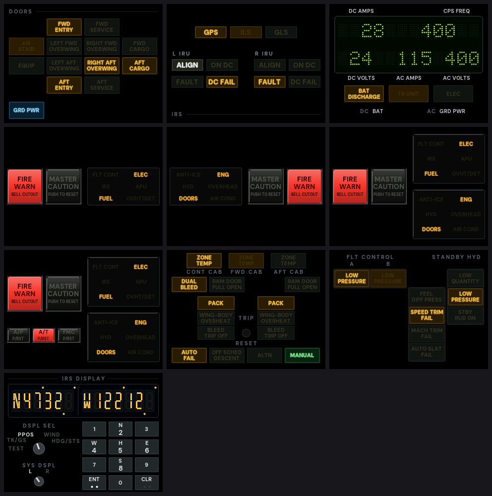

<!-- markdownlint-disable MD033 -->

## What you need

- **A display board** — one of the two below, all-in-one, with no wiring. The 3.5″ board is
  the one to buy.
- **MobiFlight Connector 11.2** or newer, on the PC running the sim.
- **MSFS 2024 with the PMDG 737-800**, and **FSUIPC7** — every panel reads the aircraft
  through it.
- Chrome or Edge, to flash the firmware from the browser. Nothing has to be built.

| | LCDWIKI E32R32P | Caturda C3248W535 — **recommended** |
|---|---|---|
| Price | about €18 | about €29 |
| Screen | 3.2" 240×320 IPS, drawn as **320×240** | 3.5" 320×480 IPS, drawn as **480×320** |
| Touch | resistive, needs a one-off calibration | capacitive, factory-calibrated |
| MCU | ESP32-WROOM-32E, 4 MB flash | ESP32-S3-WROOM-1, 16 MB flash, 8 MB PSRAM |
| USB | CH340C — needs the [launcher](#4-install-the-package) | native USB, nothing to work around |
| Build env | `annunciator_e32r32p` | `annunciator_c3248w535` |

**Buy the 3.5″ board.** For €11 more it is substantially better on both counts that matter
in a cockpit. The picture has much more contrast and brightness, so lit lamps stand out
from unlit ones the way real annunciators do. And its capacitive touch is a different
experience from the 3.2″ board's resistive panel: a light tap registers first time, where
the resistive one wants a firm, deliberate press. It also needs neither a touch calibration
nor the launcher. The 3.2″ board works, and every panel runs on it — but it is the one to
use only if you already have it.

Both screens are the same physical size, so the 3.5" board is not a bigger panel — it is
the same panel drawn with 1.8× the pixels. Text is noticeably sharper and the lamps are
about 7% larger. Here is one panel on each, scaled so a millimetre is a millimetre:

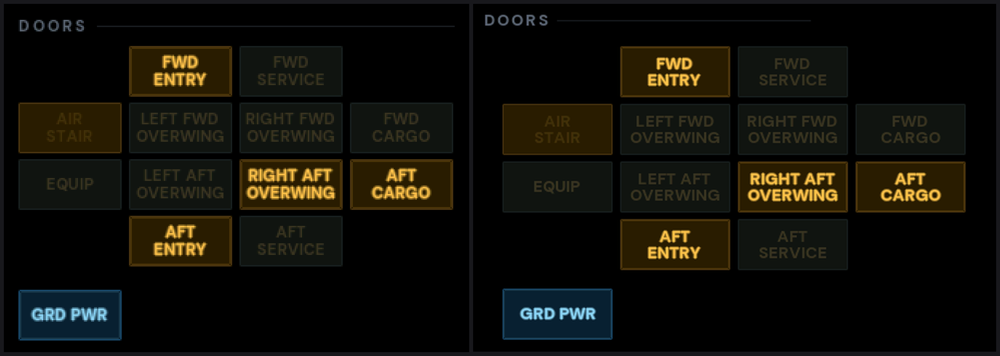

The Caturda is also sold as the Guition or JCZN **JC3248W535EN**. Take the capacitive
version, and don't confuse it with the 4.3" JC4827W543 — different display controller
entirely.

## The panels

All ten ship in **one firmware image per board type** — every board of a type gets the
same `.bin`. Which panel a board shows is chosen in the Connector, by which custom device
you add to it, so a board becomes a different panel without reflashing.

| | Panel | Custom device type | Touch |
|---|---|---|---|
| 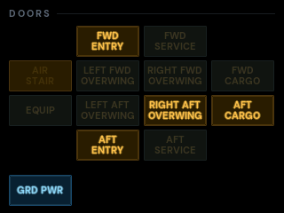 | **Doors** — the 12 door lamps plus GRD PWR, arranged so a lamp's place on screen matches its place on the airframe | `ANNUN_DOOR` | every lamp opens or closes that door |
| 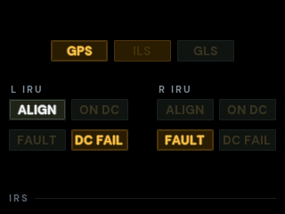 | **IRS mode select unit** — GPS, ILS, GLS and both IRUs | `ANNUN_IRS` | — |
| 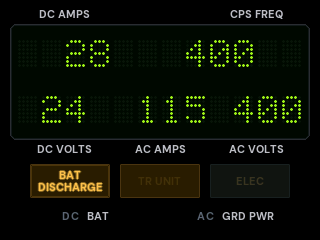 | **AC & DC metering** — the two-line dot-matrix window and its lamps | `ANNUN_ELEC` | — |
| 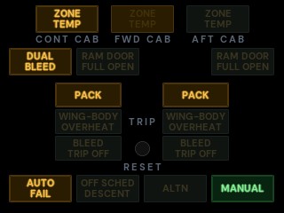 | **Air conditioning**, bleed and pressurisation | `ANNUN_AIR` | — |
| 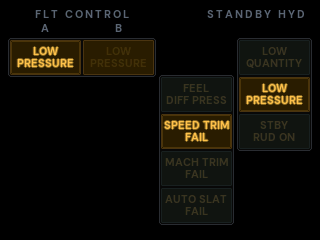 | **Flight controls** | `ANNUN_FCTL` | — |
| 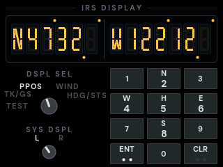 | **IRS display unit** — both segmented displays, the two knobs and the keypad | `ANNUN_ISDU` | keypad and knobs both work |
| 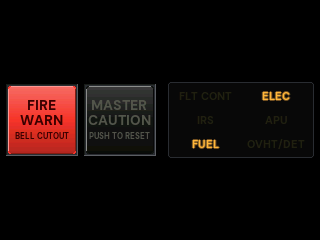 | **Master caution, captain's side** | `ANNUN_MCS_L` | FIRE WARN, MASTER CAUTION, six-pack recall |
| 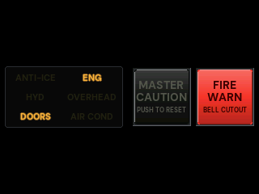 | **Master caution, first officer's side** | `ANNUN_MCS_R` | the same |
| 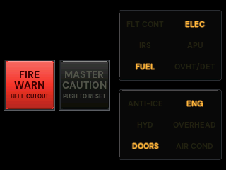 | **Master caution, both six-packs** on one screen | `ANNUN_MCS_BOTH` | the same, with a recall per six-pack |
| 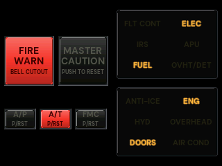 | **Master caution with AFDS** — the combined layout plus the autoflight P/RST lights, A/P, A/T and FMC | `ANNUN_MCS_BOTH_AFDS` | the same, plus the three P/RST lights |

Touch is not something the real aircraft does. It is there because pressing a door
annunciator is quicker than breaking out of FMS mode on the CDU or digging for the EFB.

## How it works

This is a [MobiFlight CommunityTemplate](https://github.com/MobiFlight/CommunityTemplate)
project. The MobiFlight core firmware is not vendored here — the build clones it into
`./src` and compiles it alongside the sources in `Annunciator/`. The core owns the serial
protocol, the handshake, config storage in EEPROM and power saving; this repo implements
the four custom-device functions and the panel renderers.

The board appears in the Connector as a controller with one custom device on it. Lamps are
outputs, touch buttons are inputs, and both are bound in an ordinary MobiFlight profile.
Ready-made profiles for the PMDG 737-800 are generated by `tools/make_profiles.py` and
live in [`profiles/`](profiles/).

Only two files know which board they are on: `Annunciator/Board.h`, which holds the pins
and the screen size, and `Annunciator/Gfx.h`, which picks the display library. The panel
layouts are written once and carry a set of dimensions for each screen, checked at compile
time — a legend that no longer fits its lamp fails the build rather than the flight.

The core comes from `elral/MobiFlight-FirmwareSource` branch `ESP32_support`, because
upstream MobiFlight has no ESP32 target at any released version. The handbook explains
that choice, the version it reports, and the one patch applied to it on every fetch.

## Setup

About half an hour, start to finish, on the PC that runs the sim. Do the steps in order. Where
a step differs between the two boards it says so; otherwise it is the same for both.

**You will need:** the board and a USB cable · MSFS 2024 with the PMDG 737-800 ·
[MobiFlight Connector](https://www.mobiflight.com/) 11.2 or newer · [FSUIPC7](https://fsuipc.com/)
7.5.6 or newer · Chrome or Edge · [Python 3](https://www.python.org/downloads/) (step 6 only).

### 1. Download the files

Open the **[latest release](../../releases/latest)** and download:

| File | Board |
|---|---|
| `Annunciator_<version>.zip` — the MobiFlight package | both |
| `annunciator_e32r32p_<version>_full.bin` — firmware | 3.2″ |
| `annunciator_c3248w535_<version>_full.bin` — firmware | 3.5″ |
| `Start-MobiFlight-E32R32P.bat` — Connector launcher | 3.2″ |
| **Source code (zip)** — the profiles and the tool that makes them | both |

Unzip *Source code* somewhere you will find it again, such as `Documents`. The folder it makes
is the one steps 6 and 7 refer to.

### 2. Flash the firmware

1. Plug the board into the PC.
   - **3.2″:** use a **USB-A to USB-C** cable. A C-to-C cable does not work with this board.
2. In Chrome or Edge, open the **[ESP web flasher](https://espressif.github.io/esptool-js/)**.
3. Set **Baudrate**:
   - **3.2″:** `230400` — its USB chip fails at faster speeds.
   - **3.5″:** leave it as it is.
4. Click **Connect** and choose the board's port.
   - **3.5″:** if it does not appear, unplug the board, hold its **BOOT** button while you plug
     it back in, then try again.
5. Set **Flash Address** to `0x0`, choose your board's `_full.bin` file, and click **Program**.
6. When it reports that it is done, unplug the board and plug it back in.

The screen stays dark until MobiFlight sends it something. That is normal.

### 3. Prepare the sim (once)

1. **FSUIPC7** must be installed, and running whenever you fly. Every panel reads the aircraft
   through it.
2. **Switch on PMDG's data broadcast.** Load the 737-800 once, until it is ready to fly, so its
   settings file exists. Close the sim. Open `737_Options.ini` in Notepad — it is in:
   - Steam: `%APPDATA%\Microsoft Flight Simulator 2024\WASM\MSFS2024\pmdg-aircraft-738\work\`
   - Microsoft Store / Game Pass:
     `%LOCALAPPDATA%\Packages\Microsoft.Limitless_8wekyb3d8bbwe\LocalState\WASM\MSFS2024\pmdg-aircraft-738\work\`

   Add these two lines at the very end, **followed by one empty line**, and save:
   ```ini
   [SDK]
   EnableDataBroadcast=1
   ```
   Without the empty line PMDG ignores the last line. If your overhead's FLT ALT and LAND ALT
   windows already show digits in the 737-800, this is already on and you can skip it.
3. **MobiFlight's WASM module** — the Connector installs it. If it offers to, say yes.

### 4. Install the package

1. Close the MobiFlight Connector.
2. Open File Explorer, click the address bar, paste
   `%LOCALAPPDATA%\MobiFlight\MobiFlight Connector\Community` and press Enter.
3. Unzip `Annunciator_<version>.zip` into that folder. You should end up with a folder called
   `Annunciator` there, containing `boards`, `devices` and `firmware`.
4. Start the Connector.
   - **3.2″ — from now on, always start the Connector with the launcher.** This board shares
     its USB id with many Arduino clones, and the Connector opens it the way it opens an
     Arduino, which resets the board into a mode where it cannot answer. It then shows up as a
     *compatible module* offering to upload firmware — never accept that. To prevent it:
     1. Find the board's COM port: Device Manager → **Ports (COM & LPT)** → *USB-SERIAL CH340
        (COMn)*.
     2. Right-click `Start-MobiFlight-E32R32P.bat` → **Edit**, change `COM7` on the
        `set PORTS=COM7` line to your port, and save.
     3. Double-click it to start the Connector. Keep the board in the same USB socket, or its
        COM number changes.

     If Windows refuses to run the batch file, the
     [handbook](docs/handbook.md#installing-into-mobiflight-connector) has a shortcut that does
     the same.
   - **3.5″:** nothing extra. It has its own USB id and no reset circuit.

The package is what lets the Connector recognise the board. Without it the board appears as
an unknown or incompatible module.

### 5. Put a panel on the board

A board shows one panel at a time. You choose which one here, and can change it later without
reflashing.

1. In the Connector, press **Stop** if it is running.
2. Open **Extras → Settings → MobiFlight Modules**. The board is listed as **Annunciator**
   (3.2″) or **Annunciator 35** (3.5″).
3. Select the board, then **Add device → Custom Devices**, and pick the panel — *Door
   Annunciator*, *Master Caution*, *IRS Display Unit* and so on.
4. **Leave the pin as it is offered** — it is the backlight — and confirm.
5. Click **Upload config**, wait for it to finish, and close the dialog.
6. **Write down the board's serial number**: `SN-` followed by 12 characters, shown with the
   board in the same list. You need it in the next step.

### 6. Make the profiles for your board

The profiles connect each lamp and button to the aircraft. Each one is tied to a single board's
serial number, and the ones in the download are made for the author's board. **Loaded as they
are, they do nothing — with no error to tell you.** This step makes a set for yours.

1. Install [Python 3](https://www.python.org/downloads/). The default options are fine.
2. In File Explorer, open the folder you unzipped *Source code* into — the one that contains
   `README.md` and a `tools` folder.
3. Click the address bar, type `cmd`, and press Enter. A command window opens in that folder.
4. Type the line for your board, with your serial number in place of the X's, and press Enter:

   ```bat
   py tools\make_profiles.py --serial "Annunciator/ SN-XXXXXXXXXXXX"
   ```
   for a **3.2″** board, or
   ```bat
   py tools\make_profiles.py --serial "Annunciator 35/ SN-XXXXXXXXXXXX"
   ```
   for a **3.5″** board.

5. It prints one line per panel. The files in the `profiles` folder are now made for your
   board.

**More than one board?** Give each board its panel and serial in one command:

```bat
py tools\make_profiles.py --board "door=SN-AAAAAAAAAAAA:Annunciator" --board "mcs_both_afds=SN-BBBBBBBBBBBB:Annunciator 35"
```

That also writes `Annunciator-Combined-PMDG737-800.mfproj`, with every board's panel in one
file, so step 7 is a single merge. If two of your boards are the same kind, give each its own
name in **MobiFlight Modules** first and use those names here. The names to use for `--board`:

| Panel | Name | Panel | Name |
|---|---|---|---|
| Doors | `door` | IRS display unit | `isdu` |
| IRS mode select unit | `irs` | Master caution, captain | `mcs_l` |
| AC & DC metering | `elec` | Master caution, first officer | `mcs_r` |
| Air conditioning | `air` | Master caution, both | `mcs_both` |
| Flight controls | `fctl` | Master caution with AFDS | `mcs_both_afds` |

### 7. Add the profile to your project

1. In the Connector, open the project you fly with — the one with your overhead in it.
2. Click the **+** after the last tab, choose **From existing project**, and pick your panel's
   file from the `profiles` folder (or the *Combined* file, for several boards). It arrives
   as a new tab.
3. **Save.**

Use **+ → From existing project**, not *File → Open*: opening a profile replaces your whole
project with it.

| Panel | Profile |
|---|---|
| Doors | [Annunciator-Doors-PMDG737-800.mfproj](profiles/Annunciator-Doors-PMDG737-800.mfproj) |
| IRS mode select unit | [Annunciator-IRS-PMDG737-800.mfproj](profiles/Annunciator-IRS-PMDG737-800.mfproj) |
| AC & DC metering | [Annunciator-Electrical-PMDG737-800.mfproj](profiles/Annunciator-Electrical-PMDG737-800.mfproj) |
| Air conditioning | [Annunciator-AirCond-Bleed-Press-PMDG737-800.mfproj](profiles/Annunciator-AirCond-Bleed-Press-PMDG737-800.mfproj) |
| Flight controls | [Annunciator-FlightControls-PMDG737-800.mfproj](profiles/Annunciator-FlightControls-PMDG737-800.mfproj) |
| IRS display unit | [Annunciator-IRS-DisplayUnit-PMDG737-800.mfproj](profiles/Annunciator-IRS-DisplayUnit-PMDG737-800.mfproj) |
| Master caution, captain | [Annunciator-MasterCaution-Captain-PMDG737-800.mfproj](profiles/Annunciator-MasterCaution-Captain-PMDG737-800.mfproj) |
| Master caution, first officer | [Annunciator-MasterCaution-FO-PMDG737-800.mfproj](profiles/Annunciator-MasterCaution-FO-PMDG737-800.mfproj) |
| Master caution, both | [Annunciator-MasterCaution-Both-PMDG737-800.mfproj](profiles/Annunciator-MasterCaution-Both-PMDG737-800.mfproj) |
| Master caution with AFDS | [Annunciator-MasterCaution-Both-AFDS-PMDG737-800.mfproj](profiles/Annunciator-MasterCaution-Both-AFDS-PMDG737-800.mfproj) |

### 8. Check it works

1. Start the sim and load the 737-800. Make sure FSUIPC7 is running.
2. Press **Run** in the Connector.
3. Turn the **battery** on. The panel lights up and shows the aircraft's state.
4. Set the overhead's lights switch to **TEST**. Every lamp should light.

**If the panel stays dark:**
- Is the Connector running (**Run** pressed), and is FSUIPC7 running?
- Is PMDG's data broadcast on? (Step 3.)
- Were the profiles made for *this* board's serial number? (Step 6.) A profile for another board
  does nothing, without any error.
- **3.2″:** was the Connector started with the launcher? If the board shows as a *compatible
  module*, close the Connector, unplug the board and plug it back in, and start it with the
  launcher.

The [handbook](docs/handbook.md) covers everything else: changing a board to another panel,
Test Mode, power saving, and the full message reference.

## Building from source

```bash
git clone <this repo> && cd door-annunciator
pio run -e annunciator_e32r32p   -t upload     # the 3.2in board
pio run -e annunciator_c3248w535 -t upload     # the 3.5in board
pio run -t annunciator_package                 # everything that goes on a release, in _dist/
```

The first build clones the MobiFlight core firmware into `./src`. `annunciator_package`
writes the Connector zip, a full flash image for each board, and the launcher into `_dist/`
— exactly the set of files a release carries. Set `VERSION` (e.g. `VERSION=1.0.0`) to stamp
a release number into all of them; without it they are `0.0.1`, which the Connector treats
as development firmware and never offers to update.

→ **[The handbook](docs/handbook.md)** has everything in detail: the pinout for each board,
the full message reference, how the profiles are generated and bound, touch calibration,
the hardware findings for the 3.5″ panel, and bring-up for new hardware.

## Previewing without hardware

The panels are laid out by hand in code, to the pixel, and iterating on that by
flashing a board is slow. So the renderer builds for the desktop too:

```bash
python3 tools/preview/build.py          # compiles the real panel sources, both screen sizes
python3 tools/preview/render_all.py     # every panel, every state, as PNGs
python3 tools/preview/contact_sheet.py  # the sheet at the top of this page
```

The previews come from the firmware's own layout tables, its own glyph metrics and the
same embedded font, so positions, sizes and text are the board's; only anti-aliased edges
differ. `render_all.py --check` compares a render against a blessed set and says how many
pixels moved, which is how a layout change gets reviewed. Building both sizes is also the
layout gate: every `static_assert` in the panels is evaluated for each screen.

## Repo layout

```
Annunciator/            the firmware
  Board.h                 the only file that names a pin or a screen size
  Gfx.h                   the only file that names a graphics library
  Layout.h                the design language: margins, lens size, gutters, touch minimums
  MFCustomDevice.{h,cpp}  MobiFlight integration: custom device type -> panel
  PanelGfx.{h,cpp}        display bring-up, lamp and text rendering
  LampPanel.{h,cpp}       the engine for panels that are just lamps, run from a table
  Touch*.{h,cpp}          touch polling, calibration, and zones -> button events
  <Name>Panel/            one directory per panel
  fonts/                  DM Sans Bold, embedded, with the metrics the renderer measures by
  Community/              the board and device definitions the Connector reads
profiles/               ready-made MobiFlight projects for the PMDG 737-800
windows/                the Connector launcher for the 3.2in board
tools/                  profile generator, definition checks, a bench tool, the host preview
docs/handbook.md        everything in detail
```

Known gaps are listed at the end of the handbook.

## Credits

- [MobiFlight](https://www.mobiflight.com/) for the Connector and the core firmware, and
  for the CommunityTemplate this is built on.
- [elral](https://github.com/elral/MobiFlight-FirmwareSource) for the ESP32 support the
  core firmware needs.
- [Bodmer/TFT_eSPI](https://github.com/Bodmer/TFT_eSPI) and
  [lovyan03/LovyanGFX](https://github.com/lovyan03/LovyanGFX) for the display libraries,
  and [moononournation/Arduino_GFX](https://github.com/moononournation/Arduino_GFX) for the
  QSPI transport the 3.5" panel needs.
- [DM Sans](https://fonts.google.com/specimen/DM+Sans) by the DM Sans Project Authors,
  under the SIL Open Font License 1.1 — see [`fonts/OFL.txt`](fonts/OFL.txt). The embedded
  font headers are generated from it by `tools/make_vlw.py`.

## Licence

This repository's own code and definitions are [MIT](LICENSE).

The firmware images on each release also contain other people's code — the MobiFlight core
firmware, the display libraries and the Arduino core for the ESP32 — under MIT, BSD and LGPL
licences. Every component, its licence and its notices are in
[THIRD-PARTY-NOTICES.md](THIRD-PARTY-NOTICES.md), and each release carries that file and the
licence texts alongside the binaries.
